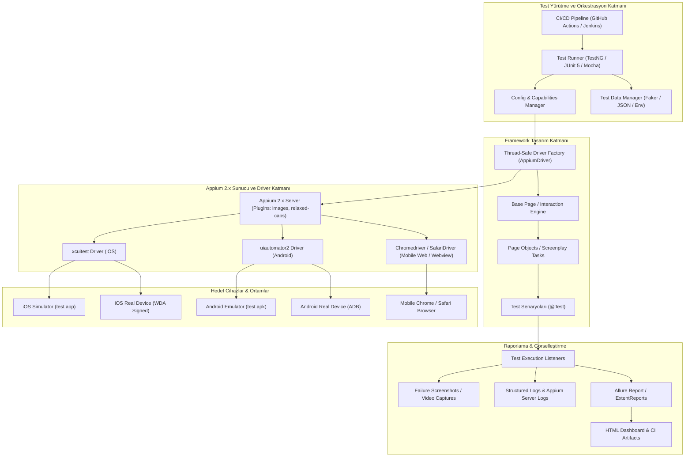

# 📱 Kurumsal Seviye Mobil Test Otomasyon Çerçevesi (Mobile QA Automation Framework) Mimarisi ve Yol Haritası

Bu doküman; **iOS (XCUITest)**, **Android (UIAutomator2)**, **Hibrit Uygulamalar (WebView)** ve **Mobil Web (Safari / Chrome)** platformlarını kapsayan, ölçeklenebilir, paralel çalışabilen ve CI/CD pipeline süreçlerine tam entegre, modern bir Mobil Test Otomasyon Çerçevesi mimarisini ve adım adım uygulama yol haritasını içerir.

---

## 📑 İçindekiler
1. [Mimarinin Genel Görünümü (High-Level Architecture)](#1-mimarinin-genel-görünümü-high-level-architecture)
2. [Adım 1: Ortam Kurulumu ve Konfigürasyon Mimarisi](#adım-1-ortam-kurulumu-ve-konfigürasyon-mimarisi)
3. [Adım 2: Proje Yapısı ve Tasarım Deseni (Page Object Model / Screenplay)](#adım-2-proje-yapısı-ve-tasarım-deseni-page-object-model--screenplay)
4. [Adım 3: Locator Stratejisi ve Appium Inspector Rehberi](#adım-3-locator-stratejisi-ve-appium-inspector-rehberi)
5. [Adım 4: Hibrit Testler ve Context Switching (Native + WebView + Mobil Web)](#adım-4-hibrit-testler-ve-context-switching-native--webview--mobil-web)
6. [Adım 5: Loglama, Raporlama (Allure) ve Flaky Test Yönetimi](#adım-5-loglama-raporlama-allure-ve-flaky-test-yönetimi)
7. [Adım 6: CI/CD Pipeline Entegrasyonu (GitHub Actions & Jenkins)](#adım-6-cicd-pipeline-entegrasyonu-github-actions--jenkins)
8. [En İyi Mühendislik Pratikleri ve Olası Tuzaklar (Pitfalls & Best Practices)](#en-i̇yi-mühendislik-pratikleri-ve-olası-tuzaklar-pitfalls--best-practices)

---

## 1. Mimarinin Genel Görünümü (High-Level Architecture)



---

## Adım 1: Ortam Kurulumu ve Konfigürasyon Mimarisi

### 1.1 Temel Gereksinimler ve Versiyon Standartları
* **Node.js**: `v20.x LTS` veya üzeri
* **JDK**: `Java 17 / 21 LTS`
* **Appium Server**: `Appium 2.x` (Monolitik Appium 1.x kesinlikle terk edilmelidir)
* **Android SDK**: Build Tools `34.x+`, Platform Tools `34.x+`
* **Xcode (macOS)**: `15.x+` ve Xcode Command Line Tools

### 1.2 Ortam Değişkenleri (.zshrc / .bashrc / Windows Environment)
```bash
# Java Yapılandırması
export JAVA_HOME=$(/usr/libexec/java_home -v 17)
export PATH=$JAVA_HOME/bin:$PATH

# Android SDK Yapılandırması
export ANDROID_HOME=$HOME/Library/Android/sdk
export ANDROID_SDK_ROOT=$ANDROID_HOME
export PATH=$PATH:$ANDROID_HOME/emulator
export PATH=$PATH:$ANDROID_HOME/platform-tools
export PATH=$PATH:$ANDROID_HOME/cmdline-tools/latest/bin
export PATH=$PATH:$ANDROID_HOME/tools
export PATH=$PATH:$ANDROID_HOME/tools/bin

# Node & Global NPM
export PATH=$PATH:/usr/local/bin
```

### 1.3 Appium 2.x Driver ve Plugin Kurulumları
```bash
# Appium 2.x global kurulumu
npm install -g appium

# Gerekli driver'ların bağımsız yüklenmesi
appium driver install uiautomator2
appium driver install xcuitest
appium driver install safari
appium driver install chromium

# Ortam teşhisi için Appium Doctor aracı
npm install -g @appium/doctor
appium-doctor --android
appium-doctor --ios
```

### 1.4 W3C Uyumlu Capabilities Yönetimi (JSON Tabanlı)

Capabilities tanımları sabit kodlar (hard-coded) yerine **ortam bazlı (iOS, Android, Mobil Web, Real Device)** konfigürasyon dosyalarından yönetilmelidir.

`src/test/resources/caps/android-caps.json`:
```json
{
  "platformName": "Android",
  "appium:automationName": "UiAutomator2",
  "appium:deviceName": "Pixel_7_API_34",
  "appium:udid": "emulator-5554",
  "appium:app": "${PROJECT_DIR}/apps/test.apk",
  "appium:appPackage": "com.example.testapp",
  "appium:appActivity": "com.example.testapp.MainActivity",
  "appium:noReset": false,
  "appium:fullReset": false,
  "appium:autoGrantPermissions": true,
  "appium:newCommandTimeout": 300,
  "appium:chromedriverAutodownload": true
}
```

`src/test/resources/caps/ios-caps.json`:
```json
{
  "platformName": "iOS",
  "appium:automationName": "XCUITest",
  "appium:deviceName": "iPhone 15 Pro",
  "appium:platformVersion": "17.4",
  "appium:udid": "auto",
  "appium:app": "${PROJECT_DIR}/apps/test.app",
  "appium:bundleId": "com.example.testapp",
  "appium:noReset": false,
  "appium:wdaLocalPort": 8100,
  "appium:wdaLaunchTimeout": 120000,
  "appium:shouldTerminateApp": true
}
```

---

## Adım 2: Proje Yapısı ve Tasarım Deseni (Page Object Model / Screenplay)

Kurumsal test mimarisinde **Thread-Safe Driver Factory**, **Fluent Page Object Model (POM)** veya **Screenplay Pattern** kullanılmalıdır.

### 2.1 Önerilen Proje Klasör Hiyerarşisi (Java + TestNG / Maven)

```
qa-mobile/
├── apps/
│   ├── test.apk                  # Android hedef test binary
│   └── test.app                  # iOS Simulator hedef binary
├── src/
│   ├── main/java/com/company/mobile/
│   │   ├── config/               # Config okuyucular (Owner/Typesafe config)
│   │   ├── constants/            # Sabitler ve Timeout tanımları
│   │   ├── drivers/              # Thread-Safe DriverManager & DriverFactory
│   │   │   ├── DriverManager.java
│   │   │   └── TargetPlatform.java
│   │   ├── enums/                # Platform, Context, WaitType enums
│   │   ├── exceptions/           # Özel framework istisnaları
│   │   ├── pages/                # Page Object sınıfları (Ekran Bazlı)
│   │   │   ├── common/           # Ortak bileşenler (Navbar, Modal)
│   │   │   ├── android/          # Android spesifik ekranlar
│   │   │   ├── ios/              # iOS spesifik ekranlar
│   │   │   └── BasePage.java     # Çekirdek etkileşim & akıllı bekleme motoru
│   │   └── utils/                # Yardımcı araçlar (Gesture, Context, Video)
│   └── test/java/com/company/mobile/
│       ├── base/                 # BaseTest (Before/After hook'ları)
│       ├── listeners/            # TestNG / Allure Listeners (Failure capture)
│       └── tests/                # Test Senaryoları
│           ├── auth/
│           ├── checkout/
│           └── hybrid/
├── src/test/resources/
│   ├── caps/                     # JSON Capabilities dosyaları
│   ├── testdata/                 # JSON / YAML test veri setleri
│   ├── allure.properties         # Allure konfigürasyonu
│   ├── log4j2.xml                # Log formatları
│   └── testng-parallel.xml       # Paralel koşum suite tanımları
├── pom.xml                       # Bağımlılıklar
└── .github/workflows/mobile-ci.yml
```

### 2.2 Thread-Safe Driver Factory Örneği (Java)

Paralel test koşumlarında oturumların çakışmaması için `ThreadLocal<AppiumDriver>` kullanılmalıdır:

```java
package com.company.mobile.drivers;

import io.appium.java_client.AppiumDriver;
import io.appium.java_client.android.AndroidDriver;
import io.appium.java_client.android.options.UiAutomator2Options;
import io.appium.java_client.ios.IOSDriver;
import io.appium.java_client.ios.options.XCUITestOptions;
import org.openqa.selenium.remote.DesiredCapabilities;

import java.net.MalformedURLException;
import java.net.URI;
import java.time.Duration;

public class DriverManager {
    private static final ThreadLocal<AppiumDriver> driverThreadLocal = new ThreadLocal<>();

    private DriverManager() {}

    public static AppiumDriver getDriver() {
        return driverThreadLocal.get();
    }

    public static void setDriver(AppiumDriver driver) {
        driverThreadLocal.set(driver);
    }

    public static void createDriver(String platformName, String appiumServerUrl) {
        try {
            var serverUri = URI.create(appiumServerUrl).toURL();
            if (platformName.equalsIgnoreCase("android")) {
                UiAutomator2Options options = new UiAutomator2Options()
                        .setDeviceName("Pixel_7_API_34")
                        .setApp(System.getProperty("user.dir") + "/apps/test.apk")
                        .setAutoGrantPermissions(true)
                        .setNewCommandTimeout(Duration.ofSeconds(180));
                
                setDriver(new AndroidDriver(serverUri, options));
            } else if (platformName.equalsIgnoreCase("ios")) {
                XCUITestOptions options = new XCUITestOptions()
                        .setDeviceName("iPhone 15 Pro")
                        .setPlatformVersion("17.4")
                        .setApp(System.getProperty("user.dir") + "/apps/test.app")
                        .setWdaLaunchTimeout(Duration.ofSeconds(120));
                
                setDriver(new IOSDriver(serverUri, options));
            } else {
                throw new IllegalArgumentException("Desteklenmeyen platform: " + platformName);
            }
        } catch (MalformedURLException e) {
            throw new RuntimeException("Geçersiz Appium Server URL: " + appiumServerUrl, e);
        }
    }

    public static void quitDriver() {
        if (getDriver() != null) {
            getDriver().quit();
            driverThreadLocal.remove();
        }
    }
}
```

### 2.3 BasePage ve Akıllı Bekleme (Smart Waits) Mimarisi

`Thread.sleep()` yerine `FluentWait` ve `ExpectedConditions` kullanılmalıdır:

```java
package com.company.mobile.pages;

import com.company.mobile.drivers.DriverManager;
import io.appium.java_client.AppiumDriver;
import io.appium.java_client.pagefactory.AppiumFieldDecorator;
import org.openqa.selenium.By;
import org.openqa.selenium.WebElement;
import org.openqa.selenium.support.PageFactory;
import org.openqa.selenium.support.ui.ExpectedConditions;
import org.openqa.selenium.support.ui.FluentWait;

import java.time.Duration;

public abstract class BasePage {
    protected AppiumDriver driver;
    protected FluentWait<AppiumDriver> wait;

    public BasePage() {
        this.driver = DriverManager.getDriver();
        this.wait = new FluentWait<>(driver)
                .withTimeout(Duration.ofSeconds(15))
                .pollingEvery(Duration.ofMillis(500))
                .ignoring(Exception.class);
        PageFactory.initElements(new AppiumFieldDecorator(driver, Duration.ofSeconds(10)), this);
    }

    protected WebElement waitForVisibility(By locator) {
        return wait.until(ExpectedConditions.visibilityOfElementLocated(locator));
    }

    protected WebElement waitForClickability(By locator) {
        return wait.until(ExpectedConditions.elementToBeClickable(locator));
    }

    protected void click(By locator) {
        waitForClickability(locator).click();
    }

    protected void type(By locator, String text) {
        WebElement element = waitForVisibility(locator);
        element.clear();
        element.sendKeys(text);
    }
}
```

---

## Adım 3: Locator Stratejisi ve Appium Inspector Rehberi

Mobil otomasyonda testlerin hızını ve kararlılığını belirleyen en kritik unsur doğru **Locator Stratejisidir**.

### 3.1 Locator Öncelik Sıralaması (Hız ve Kararlılık Piramidi)

| Öncelik | Locator Türü | Android Karşılığı | iOS Karşılığı | Performans / Not |
| :--- | :--- | :--- | :--- | :--- |
| 🥇 **1. Tercih** | **Accessibility ID** | `content-desc` | `accessibilityIdentifier` | ⚡ En Hızlı, Cross-Platform ve Değişmez |
| 🥈 **2. Tercih** | **Resource ID / Name** | `resource-id` | `name` attribute | 🚀 Çok Hızlı |
| 🥉 **3. Tercih** | **Platform Native (UiAutomator / Predicate)** | `UiSelector().text("...")` | `-ios predicate string` / `class chain` | 🏎️ Hızlı & Esnek |
| ❌ **Son Çare** | **Absolute XPath** | `/hierarchy/android.widget...` | `//XCUIElementTypeWindow/...` | ⚠️ **Kaçınılmalı!** Çok yavaş ve kırılgan |

> [!CAUTION]
> **XPath Maliyeti**: Mobil DOM ağacının XPath ile taranması, özellikle derin iç içe görünümlerde (nested views) her bir element için 2-8 saniye gecikmeye yol açar. Geliştirme ekibiyle anlaşarak ekranlardaki kritik bileşenlere daima `testID` (React Native), `accessibilityIdentifier` (iOS) ve `contentDescription` (Android) eklenmelidir.

### 3.2 Appium Inspector Kullanım Adımları
1. **Appium Server'ı Başlatın**: `appium --relaxed-security`
2. **Inspector'da Bağlantı Bilgilerini Girin**:
   * Remote Host: `127.0.0.1`, Remote Port: `4723`, Remote Path: `/`
3. **Capabilities JSON Bölümüne** yukarıdaki `android-caps.json` veya `ios-caps.json` içeriğini yapıştırın.
4. **Session'ı Başlatın**:
   * *XPath yerine Accessibility ID ve Predicate önerilerini inceleyin.*
   * *Gestures sekmesinden Scroll, Swipe ve Tap hareketlerini kaydedip test edin.*

---

## Adım 4: Hibrit Testler ve Context Switching (Native + WebView + Mobil Web)

Mobil uygulamalarda (test.app / test.apk) ödeme ekranları, kullanıcı sözleşmeleri veya 3. parti modüller çoğunlukla WebView olarak açılır.

### 4.1 Context Switching Mekanizması

```java
package com.company.mobile.utils;

import com.company.mobile.drivers.DriverManager;
import io.appium.java_client.AppiumDriver;
import io.appium.java_client.remote.SupportsContextSwitching;
import org.openqa.selenium.By;

import java.util.Set;

public class ContextUtils {

    /**
     * NATIVE_APP modundan WEBVIEW moduna geçiş yapar.
     */
    public static void switchToWebView() {
        AppiumDriver driver = DriverManager.getDriver();
        if (driver instanceof SupportsContextSwitching contextDriver) {
            Set<String> contexts = contextDriver.getContextHandles();
            for (String context : contexts) {
                if (context.toUpperCase().contains("WEBVIEW")) {
                    contextDriver.context(context);
                    System.out.println("Aktif Context Değiştirildi: " + context);
                    return;
                }
            }
            throw new RuntimeException("Uygulamada herhangi bir WEBVIEW context'i bulunamadı!");
        }
    }

    /**
     * Tekrar NATIVE_APP moduna geri döner.
     */
    public static void switchToNative() {
        AppiumDriver driver = DriverManager.getDriver();
        if (driver instanceof SupportsContextSwitching contextDriver) {
            contextDriver.context("NATIVE_APP");
            System.out.println("Tekrar NATIVE_APP context'ine geçildi.");
        }
    }
}
```

### 4.2 Mobil Web (Safari / Chrome) Cross-Browser Testleri
Uygulama yüklemeden doğrudan mobil tarayıcı otomasyonu için `browserName` capability'si kullanılır:
* **Android Chrome**: `{"platformName": "Android", "browserName": "Chrome", "appium:chromedriverAutodownload": true}`
* **iOS Safari**: `{"platformName": "iOS", "browserName": "Safari", "appium:automationName": "XCUITest"}`

---

## Adım 5: Loglama, Raporlama (Allure) ve Flaky Test Yönetimi

### 5.1 TestNG Listener ile Hata Anında Otomatik Ekran Görüntüsü ve Log

```java
package com.company.mobile.listeners;

import com.company.mobile.drivers.DriverManager;
import io.qameta.allure.Attachment;
import org.openqa.selenium.OutputType;
import org.openqa.selenium.TakesScreenshot;
import org.testng.ITestListener;
import org.testng.ITestResult;

public class TestListener implements ITestListener {

    @Override
    public void onTestFailure(ITestResult result) {
        if (DriverManager.getDriver() != null) {
            saveScreenshotPNG(result.getMethod().getMethodName());
            savePageSource(result.getMethod().getMethodName());
        }
    }

    @Attachment(value = "Hata Ekran Görüntüsü - {0}", type = "image/png")
    public byte[] saveScreenshotPNG(String testName) {
        return ((TakesScreenshot) DriverManager.getDriver()).getScreenshotAs(OutputType.BYTES);
    }

    @Attachment(value = "Sayfa DOM Kaynağı - {0}", type = "text/plain")
    public String savePageSource(String testName) {
        return DriverManager.getDriver().getPageSource();
    }
}
```

### 5.2 Flaky Testleri Engelleme ve Retry Stratejisi
* **Otomatik Yeniden Deneme (Retry Analyzer)**: Ağ kesintisi veya animasyon gecikmesi kaynaklı başarısızlıklarda testi bir kereye mahsus tekrar koşturun (`IRetryAnalyzer`).
* **Animasyonları Devre Dışı Bırakma (Android)**:
  `appium:disableWindowAnimation: true` capability'si eklenerek Android sistem animasyonları kapatılmalıdır.

---

## Adım 6: CI/CD Pipeline Entegrasyonu (GitHub Actions & Jenkins)

GitHub Actions üzerinde macOS runner (iOS simülatörleri ve donanım hızlandırma için) kullanarak uçtan uca test otomasyonunu çalıştıran pipeline:

`.github/workflows/mobile-ci.yml`:
```yaml
name: Mobile Test Automation Pipeline

on:
  push:
    branches: [ main, develop ]
  pull_request:
    branches: [ main ]
  workflow_dispatch:

jobs:
  android-tests:
    runs-on: macos-13 # KVM donanım hızlandırma ve emulator desteği için macOS
    strategy:
      matrix:
        api-level: [ 33 ]
        target: [ google_apis ]
        arch: [ x86_64 ]
    steps:
      - name: Repoyu Klonla
        uses: actions/checkout@v4

      - name: Java Kurulumu (JDK 17)
        uses: actions/setup-java@v4
        with:
          distribution: 'temurin'
          java-version: '17'
          cache: 'maven'

      - name: Node.js ve Appium Kurulumu
        uses: actions/setup-node@v4
        with:
          node-version: '20'

      - name: Appium Server ve Driver Yükle
        run: |
          npm install -g appium
          appium driver install uiautomator2
          appium --log appium-server.log &
          sleep 5

      - name: Android Emulator Çalıştır ve Test Koş
        uses: reactivecircus/android-emulator-runner@v2
        with:
          api-level: ${{ matrix.api-level }}
          target: ${{ matrix.target }}
          arch: ${{ matrix.arch }}
          profile: pixel_6
          script: |
            adb devices
            mvn clean test -DsuiteXmlFile=src/test/resources/testng-android.xml

      - name: Allure Raporu Oluştur
        if: always()
        run: |
          npm install -g allure-commandline
          allure generate target/allure-results --clean -o target/allure-report

      - name: Test Raporlarını Yükle (Artifact)
        if: always()
        uses: actions/upload-artifact@v4
        with:
          name: allure-report-android
          path: target/allure-report/
```

---

## En İyi Mühendislik Pratikleri ve Olası Tuzaklar (Pitfalls & Best Practices)

### ✅ En İyi Pratikler (Best Practices)
1. **İzolasyon ve Bağımsızlık**: Her test kendi verisini üretmeli ve diğer testlerin sonucuna bağımlı olmamalıdır (`Independent Tests`).
2. **Page Object / Screenplay Ayrımı**: Sayfa sınıflarında `Assert` (Doğrulama) bulunmamalı, assert'ler yalnızca `@Test` metodlarında olmalıdır.
3. **Akıllı Kaydırma (Smart Scroll)**: Koordinat tabanlı kaydırma yerine platformun native scroll API'ları (`mobile: scroll`, `UiScrollable`) kullanılmalıdır.
4. **Driver Oturumu Yönetimi**: Her test sınıfı/metodu başında temiz oturum açılmalı ve `@AfterMethod` / `@AfterClass` ile oturum mutlaka kapatılmalıdır (`driver.quit()`).

### ⚠️ Olası Tuzaklar (Common Pitfalls)
* ❌ `Thread.sleep()` kullanımı -> Pipeline süresini uzatır ve flaky testlere sebep olur.
* ❌ Derin ve mutlak XPath kullanımı -> Cihaz OS güncellemesinde tüm testleri kırar.
* ❌ Statik/Tekil Driver Nesnesi (`public static AppiumDriver driver;`) -> Paralel koşumda oturumları çakıştırır ve testleri patlatır.
* ❌ WebView'da `chromedriver` versiyon uyuşmazlığı -> Çözüm: `appium:chromedriverAutodownload: true` aktif edilmelidir.
